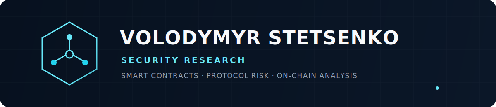

  

   

  
  
  
  

 

Independent security researcher focused on **smart-contract security, protocol risk, and on-chain incident analysis**.

## Selected work

| Project | Focus |
|---|---|
| [**Security Reviews**](https://github.com/VolodymyrStetsenko/SECURITY-REVIEW) | Public smart-contract security reports |
| [**SecureVault**](https://github.com/VolodymyrStetsenko/SecureVault-Foundry) | Foundry testing, attack simulations, fuzzing, and invariants |
| [**SecureLedger**](https://github.com/VolodymyrStetsenko/SecureLedger) | Security-focused financial ledger with auditability and concurrency controls |

## Focus

`Solidity` · `Foundry` · `Smart Contracts` · `Protocol Security` · `On-chain Analysis`

  Defensive and authorised security research.

